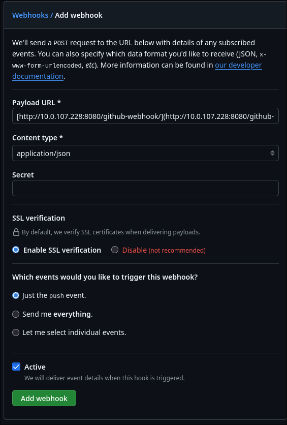

## Middleware Engineering "CI/CD Pipelines in Jenkins"

### Setup des Jenkins-Containers (Docker-out-of-Docker)

Um Jenkins zu isolieren, aber ihm dennoch zu erlauben, Container auf dem Host-System zu starten, wurde der Jenkins-Container mit Root-Rechten und einem Mount des Docker-Sockets gestartet:
Bash

docker run -u root -d -p 8080:8080 -p 50000:50000 \
-v jenkins_home:/var/jenkins_home \
-v /var/run/docker.sock:/var/run/docker.sock \
jenkins/jenkins:latest

### Installation der Docker-CLI in Jenkins

Da der Standard-Jenkins-Container keine Docker-Befehle kennt, wurde eine interaktive Bash-Session im Container gestartet (docker exec -it <container> bash). Dort wurde über apt-get die docker-ce-cli nachinstalliert. Durch die Verknüpfung mit dem docker.sock des Hosts kann Jenkins nun Images bauen und Container auf dem Arch-Linux-Host deployen.

### Konfiguration der Pipeline (Infrastructure as Code)

Im GitHub-Repository befindet sich ein fertiges Jenkinsfile, das die Pipeline in nachvollziehbare Stages unterteilt:

- Source: Auschecken des Codes via SCM (Git).

- Build: Installation der Python-Abhängigkeiten (pip install) im Build-Container.

- Test: Ausführung der Unit-Tests im Verzeichnis tests/ mittels pytest. Die Pipeline bricht bei fehlerhaften Tests automatisch ab (Qualitätssicherung).

- Run (Deployment): Starten der Applikation als lokaler Container auf Port 5556.

Zusätzlich wurden in Jenkins die notwendigen Plugins ("Docker Pipeline" und "CloudBees Docker Build") installiert, um Syntax-Fehler im Jenkinsfile zu vermeiden.

### Automatisierung des Triggers (SCM Polling / Webhook)

Das finale Ziel war der automatische Start der Pipeline bei einem Code-Push.

- Theoretischer Aufbau: In einer Produktionsumgebung (mit öffentlicher IP) wird dies über einen GitHub-Webhook gelöst, der einen POST-Request (Payload application/json) an die Jenkins-URL http://<IP>:8080/github-webhook/ sendet.
  
- Lokale Umsetzung: Da der Arch-Linux-Host hinter einem NAT-Router betrieben wird, kann GitHub die lokale IP (z.B. 10.x.x.x) nicht erreichen. Als Workaround für den lokalen Proof-of-Concept wurde in Jenkins der Trigger "Poll SCM" mit dem Cron-Ausdruck * * * * * konfiguriert. Jenkins prüft somit minütlich auf neue Commits.

